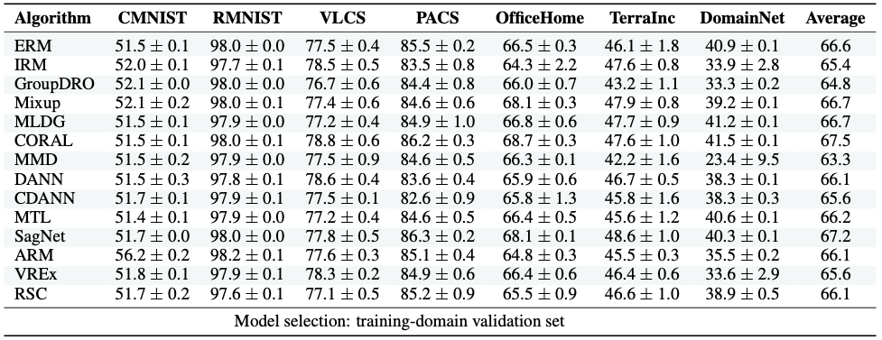

# Welcome to DomainBed

DomainBed is a PyTorch suite containing benchmark datasets and algorithms for domain generalization, as introduced in [In Search of Lost Domain Generalization](https://arxiv.org/abs/2007.01434).

## Current results



Full results for [commit 7df6f06](https://github.com/facebookresearch/DomainBed/tree/7df6f06a6f9062284812a3f174c306218932c5e4) in LaTeX format available [here](domainbed/results/2020_10_06_7df6f06/results.tex).

## Available algorithms

The [currently available algorithms](domainbed/algorithms.py) are:

* Empirical Risk Minimization (ERM, [Vapnik, 1998](https://www.wiley.com/en-fr/Statistical+Learning+Theory-p-9780471030034))
* Invariant Risk Minimization (IRM, [Arjovsky et al., 2019](https://arxiv.org/abs/1907.02893))
* Group Distributionally Robust Optimization (GroupDRO, [Sagawa et al., 2020](https://arxiv.org/abs/1911.08731))
* Interdomain Mixup (Mixup, [Yan et al., 2020](https://arxiv.org/abs/2001.00677))
* Marginal Transfer Learning (MTL, [Blanchard et al., 2011-2020](https://arxiv.org/abs/1711.07910))
* Meta Learning Domain Generalization (MLDG, [Li et al., 2017](https://arxiv.org/abs/1710.03463))
* Maximum Mean Discrepancy (MMD, [Li et al., 2018](https://openaccess.thecvf.com/content_cvpr_2018/papers/Li_Domain_Generalization_With_CVPR_2018_paper.pdf))
* Deep CORAL (CORAL, [Sun and Saenko, 2016](https://arxiv.org/abs/1607.01719))
* Domain Adversarial Neural Network (DANN, [Ganin et al., 2015](https://arxiv.org/abs/1505.07818))
* Conditional Domain Adversarial Neural Network (CDANN, [Li et al., 2018](https://openaccess.thecvf.com/content_ECCV_2018/papers/Ya_Li_Deep_Domain_Generalization_ECCV_2018_paper.pdf))
* Style Agnostic Networks (SagNet, [Nam et al., 2020](https://arxiv.org/abs/1910.11645))
* Adaptive Risk Minimization (ARM, [Zhang et al., 2020](https://arxiv.org/abs/2007.02931)), contributed by [@zhangmarvin](https://github.com/zhangmarvin)
* Variance Risk Extrapolation (VREx, [Krueger et al., 2020](https://arxiv.org/abs/2003.00688)), contributed by [@zdhNarsil](https://github.com/zdhNarsil)
* Representation Self-Challenging (RSC, [Huang et al., 2020](https://arxiv.org/abs/2007.02454)), contributed by [@SirRob1997](https://github.com/SirRob1997)
* Spectral Decoupling (SD, [Pezeshki et al., 2020](https://arxiv.org/abs/2011.09468))
* Learning Explanations that are Hard to Vary (AND-Mask, [Parascandolo et al., 2020](https://arxiv.org/abs/2009.00329))
* Out-of-Distribution Generalization with Maximal Invariant Predictor (IGA, [Koyama et al., 2020](https://arxiv.org/abs/2008.01883))
* Gradient Matching for Domain Generalization (Fish, [Shi et al., 2021](https://arxiv.org/pdf/2104.09937.pdf))
* Self-supervised Contrastive Regularization (SelfReg, [Kim et al., 2021](https://arxiv.org/abs/2104.09841))
* Smoothed-AND mask (SAND-mask, [Shahtalebi et al., 2021](https://arxiv.org/abs/2106.02266))
* Invariant Gradient Variances for Out-of-distribution Generalization (Fishr, [Rame et al., 2021](https://arxiv.org/abs/2109.02934))
* Learning Representations that Support Robust Transfer of Predictors (TRM, [Xu et al., 2021](https://arxiv.org/abs/2110.09940))
* Invariance Principle Meets Information Bottleneck for Out-of-Distribution Generalization (IB-ERM , [Ahuja et al., 2021](https://arxiv.org/abs/2106.06607))
* Invariance Principle Meets Information Bottleneck for Out-of-Distribution Generalization (IB-IRM, [Ahuja et al., 2021](https://arxiv.org/abs/2106.06607))
* Optimal Representations for Covariate Shift (CAD & CondCAD, [Ruan et al., 2022](https://arxiv.org/abs/2201.00057)), contributed by [@ryoungj](https://github.com/ryoungj)

Send us a PR to add your algorithm! Our implementations use ResNet50 / ResNet18 networks ([He et al., 2015](https://arxiv.org/abs/1512.03385)) and the hyper-parameter grids [described here](domainbed/hparams_registry.py).

## Available datasets

The [currently available datasets](domainbed/datasets.py) are:

* RotatedMNIST ([Ghifary et al., 2015](https://arxiv.org/abs/1508.07680))
* ColoredMNIST ([Arjovsky et al., 2019](https://arxiv.org/abs/1907.02893))
* VLCS  ([Fang et al., 2013](https://openaccess.thecvf.com/content_iccv_2013/papers/Fang_Unbiased_Metric_Learning_2013_ICCV_paper.pdf))
* PACS ([Li et al., 2017](https://arxiv.org/abs/1710.03077))
* Office-Home ([Venkateswara et al., 2017](https://arxiv.org/abs/1706.07522))
* A TerraIncognita ([Beery et al., 2018](https://arxiv.org/abs/1807.04975)) subset
* DomainNet ([Peng et al., 2019](http://ai.bu.edu/M3SDA/))
* A SVIRO ([Dias Da Cruz et al., 2020](https://arxiv.org/abs/2001.03483)) subset
* WILDS ([Koh et al., 2020](https://arxiv.org/abs/2012.07421)) FMoW ([Christie et al., 2018](https://arxiv.org/abs/1711.07846)) about satellite images
* WILDS ([Koh et al., 2020](https://arxiv.org/abs/2012.07421)) Camelyon17 ([Bandi et al., 2019](https://pubmed.ncbi.nlm.nih.gov/30716025/)) about tumor detection in tissues

Send us a PR to add your dataset! Any custom image dataset with folder structure `dataset/domain/class/image.xyz` is readily usable. While we include some datasets from the [WILDS project](https://wilds.stanford.edu/), please use their [official code](https://github.com/p-lambda/wilds/) if you wish to participate in their leaderboard.

## Available model selection criteria

[Model selection criteria](domainbed/model_selection.py) differ in what data is used to choose the best hyper-parameters for a given model:

* `IIDAccuracySelectionMethod`: A random subset from the data of the training domains.
* `LeaveOneOutSelectionMethod`: A random subset from the data of a held-out (not training, not testing) domain.
* `OracleSelectionMethod`: A random subset from the data of the test domain.

## Quick start

Download the datasets:

```sh
python3 -m domainbed.scripts.download \
       --data_dir=./domainbed/data
```

Train a model:

```sh
python3 -m domainbed.scripts.train\
       --data_dir=./domainbed/data/MNIST/\
       --algorithm IGA\
       --dataset ColoredMNIST\
       --test_env 2
```

Launch a sweep:

```sh
python -m domainbed.scripts.sweep launch\
       --data_dir=/my/datasets/path\
       --output_dir=/my/sweep/output/path\
       --command_launcher MyLauncher
```

Here, `MyLauncher` is your cluster's command launcher, as implemented in `command_launchers.py`. At the time of writing, the entire sweep trains tens of thousands of models (all algorithms x all datasets x 3 independent trials x 20 random hyper-parameter choices). You can pass arguments to make the sweep smaller:

```sh
python -m domainbed.scripts.sweep launch\
       --data_dir=/my/datasets/path\
       --output_dir=/my/sweep/output/path\
       --command_launcher MyLauncher\
       --algorithms ERM DANN\
       --datasets RotatedMNIST VLCS\
       --n_hparams 5\
       --n_trials 1
```

After all jobs have either succeeded or failed, you can delete the data from failed jobs with ``python -m domainbed.scripts.sweep delete_incomplete`` and then re-launch them by running ``python -m domainbed.scripts.sweep launch`` again. Specify the same command-line arguments in all calls to `sweep` as you did the first time; this is how the sweep script knows which jobs were launched originally.

To view the results of your sweep:

````sh
python -m domainbed.scripts.collect_results\
       --input_dir=/my/sweep/output/path
````

## Running unit tests

DomainBed includes some unit tests and end-to-end tests. While not exhaustive, but they are a good sanity-check. To run the tests:

```sh
python -m unittest discover
```

By default, this only runs tests which don't depend on a dataset directory. To run those tests as well:

```sh
DATA_DIR=/my/datasets/path python -m unittest discover
```

## License

This source code is released under the MIT license, included [here](LICENSE).
